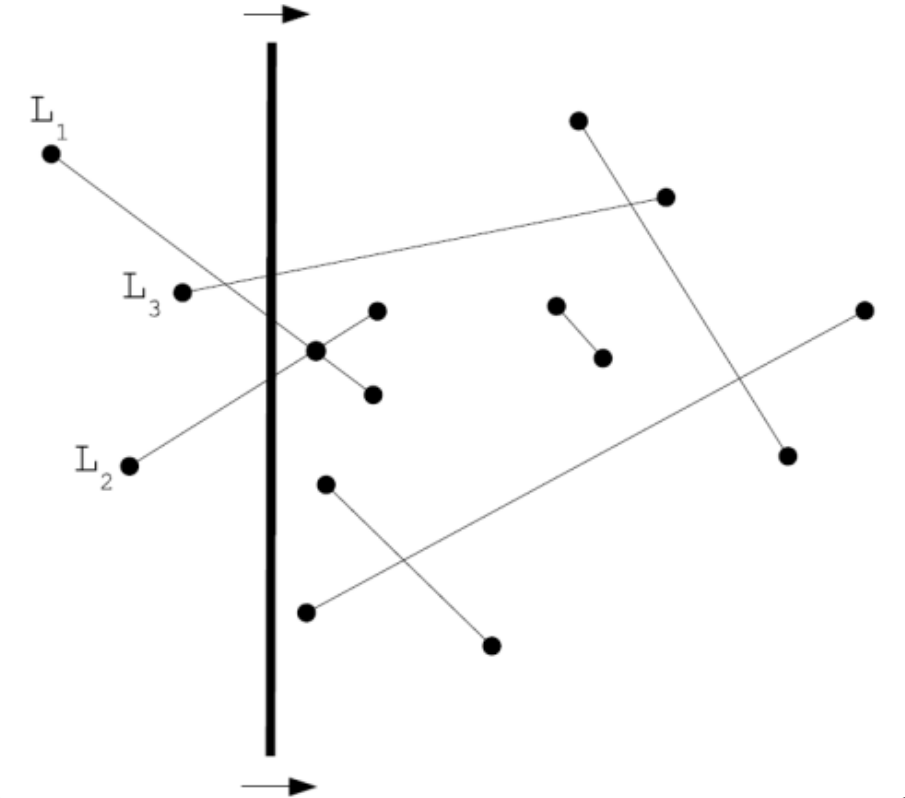
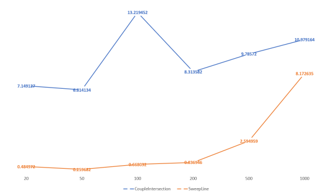

# Segment-Intersection-Complexity-Analyzer
<p align="center">
    
</p>
This Java project is dedicated to investigating the temporal complexity of the Sweepline algorithm for detecting intersections among line segments in a two-dimensional plane. Utilizing a "moving line" methodology, the Sweepline algorithm efficiently identifies intersections between line segments. The primary objective of this project is to conduct an impartial analysis of the temporal complexity associated with implementing the Sweepline algorithm in Java. 

## Implemented Algorithms
### CoupleIntersection
This algorithm is based on the brute-force approach. It iterates over all possible couples of line segments and checks whether they intersect or not. The temporal complexity of this algorithm is O(n^2).

#### Pseudocode
```
sa = segment array

for i = 0 to i = number_of_segments

    for j = i+1 to j = number_of_segments

        if sa[i] intersects sa[j]

            return true

return false
```

### SweepLine
This algorithm is based on the sweep line approach. It iterates over all line segments and checks whether they intersect or not. 
In the sweep line, an imaginary vertical line, called the "sweep line," passes through the set of geometric objects ordered from left to right, moving along the x-axis.
The sweep line involves a method for reordering geometric objects by inserting them into a dynamic data structure and exploiting the relationships between them.
Sweepline algorithms use the concept of sweep events to define the states of the sweep line where the algorithm comes into play. To detect intersections between segments, the algorithm considers all segment endpoints as sweep events, where intersection analysis is performed.

To simplify the algorithm, two assumptions are made:
- No input segment is vertical.
- There are no three segments that intersect at only one point.

Since there are no vertical segments, any input segment intersects the sweep line at most once in a certain state.

Taking two segments s₁ and s₂, they are said to be comparable in x if the sweep line with x-coordinate x intersects both of them. s₁ is said to be above s₂ and is written as s₁ >ₓ s₂ if s₁ and s₂ are comparable in x and the intersection of s₁ with the sweep line at x-coordinate x is higher than the intersection of s₂.

For any given abscissa 𝑎, the relation ">𝑎" imposes a total ordering on the segments that intersect the sweepline in x.
The algorithm in question manages two sets of data:

1. The data structure containing the breakpoints, which must be sorted.
2.  The data structure containing the segments (T).

Each segment is inserted into the database when the sweepline "encounters" its left endpoint and is deleted when the sweepline "encounters" its right endpoint.
Once a total ordering for the segments is defined, the database T is constructed in such a way that it can implement the following operations:

- INSERT (T, s) which allows inserting the segment s into the database
- DELETE (T, s) which allows deleting the segment s from the database
- ABOVE (T, s) which allows obtaining the element immediately greater than s in the ordering
- BELOW (T, s) which allows obtaining the element immediately smaller than s in the ordering

#### Pseudocode
```
T = empty tree

Sort the endpoints of the segment S from left to right, breaking ties by putting left endpoints beforeright endpoints and breaking further ties by putting endpoints with lower y-coordinates before endpoints with higher y-coordinates

for each point p in the sorted list of endpoints

if p is a left endpoint of a segment s

    INSERT(T, s)

    if (ABOVE(T, s) exists and intersects s)

        return true

    if (BELOW(T, s) exists and intersects s)

        return true

if p is a right endpoint of a segment s

    if (ABOVE(T, s) exists and BELOW(T, s) exists and ABOVE(T, s) intersects BELOW(T, s))

        return true

    DELETE(T, s)

return false
```
The temporal complexity of this algorithm is O(n log n).

#### QuickSort
The QuickSort algorithm is used to sort the endpoints of the segments from left to right. The temporal complexity of this algorithm is O(n log n).
The idea behind QuickSort is to select a pivot element, then partition the array around the pivot, and finally apply the same procedure recursively to the left and right subarrays.

## Data Structures Used
In the code implementation, it was necessary to use two data structures:
- An array to store the data related to the breakpoints
- A red-black tree to store the data related to the segments

Both data structures were used in the "sweepline" algorithm.
The choice of an array for the breakpoint data was made because it is a data structure that is easy to implement and is only inconvenient if the number of elements it will contain is not known from the beginning.
In our case, since the number of segments was known, the number of breakpoints was also known, which is equal to twice the number of segments.
This allowed us to use the quickSort sorting algorithm without difficulty.
As for the data structure related to the segments, the choice fell on red-black trees because the insert, delete, above, and below functions mentioned in the pseudocode were already available, making it necessary only to define a sorting criterion among segments.

## What to expect after running the program
The purpose of the program  is not to actually detect the presence of an intersection in a pool of segments, but to evaluate which of the two algorithms is more efficient, allowing the user to select the number of input files for which to measure the time taken by the two algorithms.
The program then performs a number of simulations equal to the input size (where input size refers to the number of segments): 20, 50, 100, 200, 500, 1000.

After a random execution of the program (with 20 input files), the following output is obtained:


Although from the graph it can be appreciated how the sweepline algorithm is more efficient, the graphs do not reflect the different growth rate of the time taken by the two algorithms, which in the case of sweepline should be logarithmic, while in the case of coupleintersection should be quadratic.
The reason lies in the fact that the probability of finding an intersection is very high, so it is detected almost immediately in the execution.
This flattens the difference between the two algorithms because not enough time passes for the smarter functioning of sweepline to fully recover the time lost for the construction of the database and the sorting of the breakpoints.
Therefore, despite the actual convenience of using sweepline, it is not the one theorized during the study of the complexity of the two algorithms.

## Pre-requisites
- Java Development Kit (JDK) 18 or higher
- Java Runtime Environment (JRE) 18 or higher

## How to run the program
From the command line, move to the directory Segments-Intersection-Complexity-Analyzer and run the following commands:
```bash
java -cp src src/Main
```
The program will ask you to enter the number of input files to be analyzed, then it will perform the simulations and finally in the output.txt file will be written the time taken by the two algorithms.

## Report
For more details about the project, please refer to the [report](report/report.pdf) file. Please note that the report is written in Italian.

## Authors
- Leonardo Ignazio Pagliochini
- Andrea Bobo
